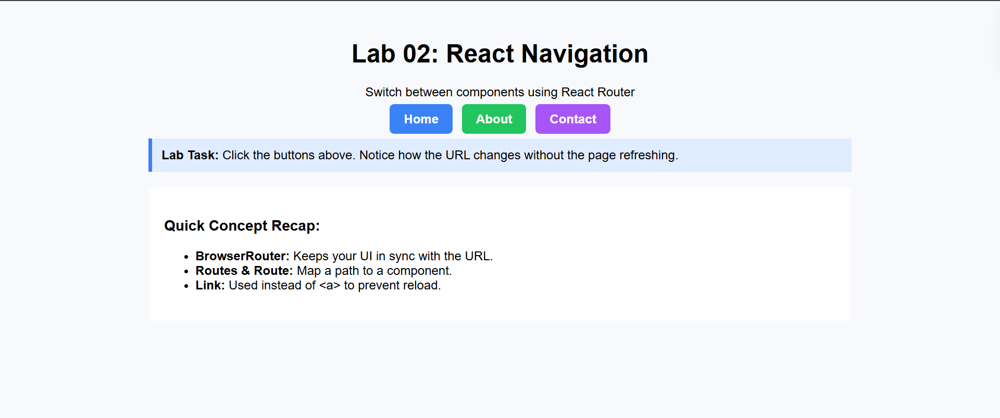

# FSD-LAB-2

A modern web application project bootstrapped with [Vite](https://vitejs.dev/).

## Quick Start from Scratch (with Vite)

To rebuild this project from scratch for practice:

1. **Create a new Vite project:**
    ```sh
    npm create latest@vite
    ```
    - Choose your framework (e.g., React, Vue, etc.) and language (JavaScript/TypeScript).

2. **Navigate to your project folder:**
    ```sh
    cd your-project-name
    ```

3. **Install dependencies:**
    ```sh
    npm install
    ```

4. **Start the development server:**
    ```sh
    npm run dev
    ```

5. **Build your application code** in the `src` folder.

---

## Project Structure

```
FSD-LAB-2/
├── public/
├── src/
│   ├── assets/
│   ├── components/
│   └── main.jsx / main.tsx
├── index.html
├── package.json
├── vite.config.js / vite.config.ts
└── README.md
```

## Features

- Fast development with Vite
- Modern JavaScript/TypeScript support
- Hot Module Replacement (HMR)
- [Add your project-specific features here]

## Scripts

- `npm run dev` – Start the development server
- `npm run build` – Build for production
- `npm run preview` – Preview the production build

## Customization

- Edit `src/` for your application code.
- Add components in `src/components/`.
- Place static assets in `public/`.

## License

[MIT](LICENSE)

---

*Refer to this README whenever you want to practice rebuilding or understanding the project structure!*


Output
